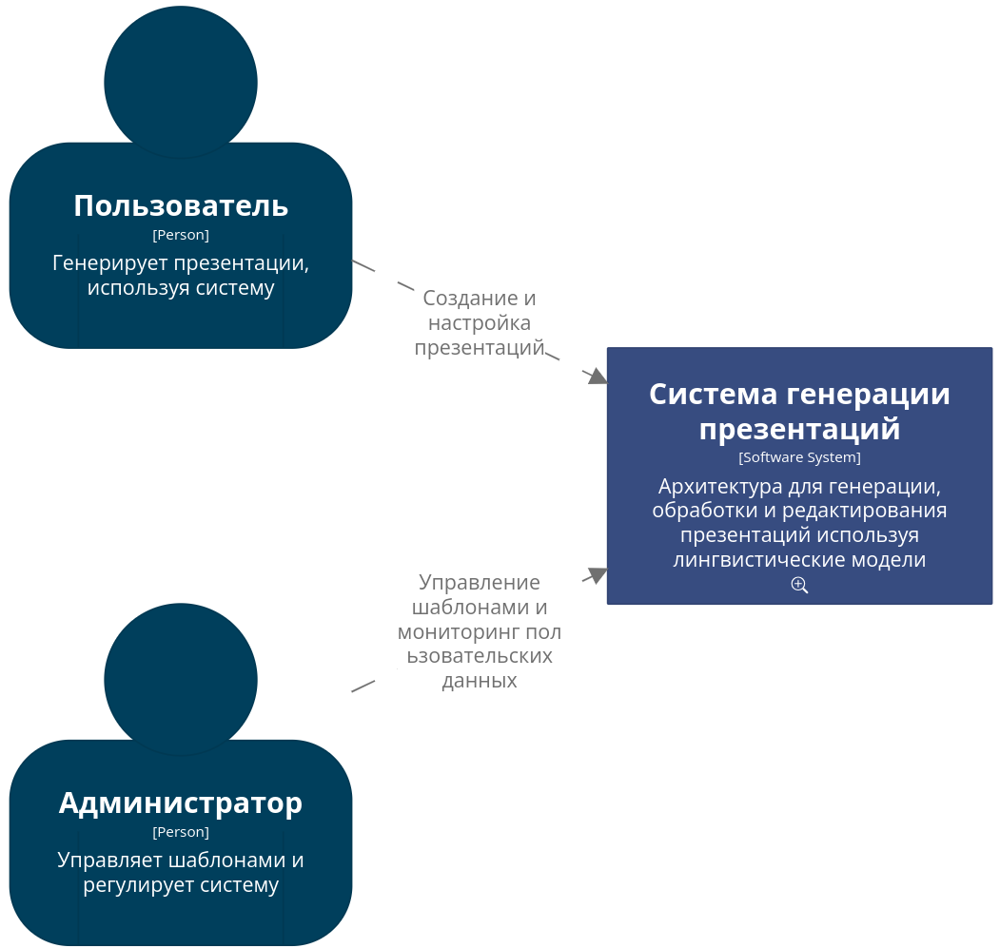
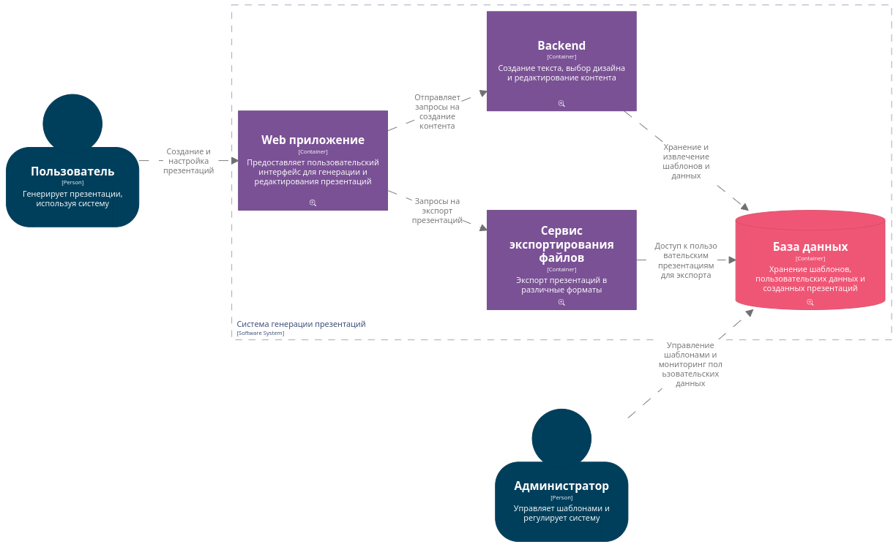
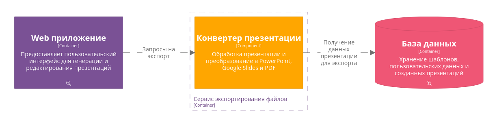

## Диаграмма системного контекста
- Пользователь
    - Взаимодействует напрямую с системой, создает презентации, настраивает, регулирует

- Администратор
    - Взаимодействует с базой данных системы, редактирует существующие шаблоны, добавляет новые, может просматривать статистику пользователей

## Диаграмма контейнеров

- Web приложение
    - Предоставляет пользователю интерфейс, позволяет взаимодействовать с другими сервисами

- Backend
    - Основной контейнер, занимающийся генерацией презентации исходя из входных данных

- Сервис экспортирования файлов (конвертер)
    - Контейнер, который получает запросы на экспорт, вместе с данными о презентации, ее идентификатор, формат вывода

- База данных
    - Хранит все необходимые данные: пользователей, пользовательские данные, презентации и т.д.

## Диаграмма компонентов контейнера Backend

- Компонент генерации текста
    - ИИ генерирует данные, которые в дальнейшем будут использоваться в презентации

- Компонент многоязычного процессора
    - Поддерживает создание контента на нескольких языках

- Компонент выбора дизайна
    - Формирует итоговый дизайн слайдов исходя из выбранного шаблона

## Диаграмма компонентов контейнера Конвертера
- Компонент преобразования
    - Получает вместе с входящим запросом данные: идентификатор презентации и формат вывода, обрабатывает заданную презентацию, преобразует ее в нужный формат и выдает результат в ответе

